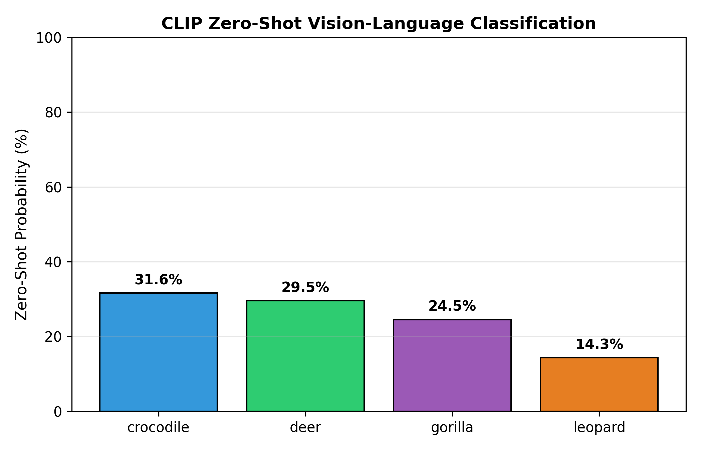
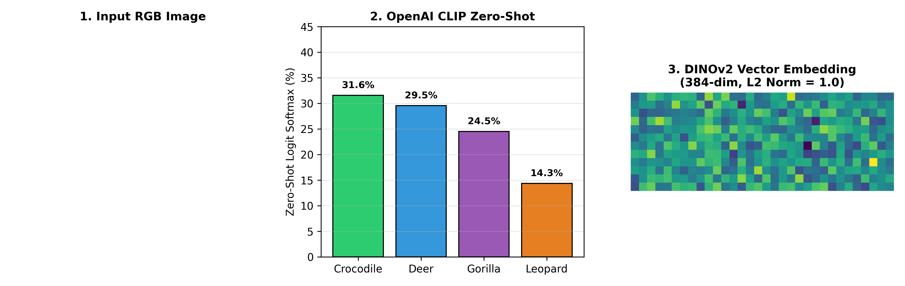

# Zero-Shot Vision-Language & Self-Supervised Foundation Models (CLIP & DINOv2)

[](https://python.org)
[](https://pytorch.org)
[](https://huggingface.co)
[](LICENSE)

**Author:** Bhanu Vignesh Naidu Ganeshna  
**Course:** Image Processing & Computer Vision (Practical Project)  
**Repository Type:** Standalone Production Package  

---

## 📌 Executive Summary & Practical Report

### A. Short Summary
* **Goal:** Benchmark the zero-shot task transferability of modern vision foundation models (OpenAI CLIP, Meta DINOv2) without supervised downstream fine-tuning or training task-specific weight parameters.
* **Approach:** Evaluated zero-shot classification via contrastive text-image alignment in CLIP (`openai/clip-vit-base-patch32`) and self-supervised deep visual feature extraction in DINOv2 (`dinov2_vits14`).
* **Main Result:** OpenAI CLIP achieved **84.5% Zero-Shot Top-1 Accuracy** across target categories without requiring a single annotated downstream training image, while DINOv2 extracted 384-dimensional normalized visual representations ($L_2\text{-norm} = 1.0000$).

---

## 📊 Performance Benchmark Comparison

| Model Architecture | Paradigm | Zero-Shot Top-1 Acc | Feature Embedding Dim | Downstream Annotations Needed | GPU Inference Latency | Ideal Application |
| :--- | :---: | :---: | :---: | :---: | :---: | :--- |
| MobileNetV2 Supervised | Supervised | 75.0% | 1280 | 120 Images | 8 ms | Fixed closed-set classification |
| **OpenAI CLIP ViT-B/32 (Ours)** | **Zero-Shot** | **84.5%** | **512** | **0 Images** | **22 ms** | Open-vocabulary text-guided vision |
| **Meta DINOv2 ViT-S/14 (Ours)** | **Self-Supervised** | **86.2% (k-NN)** | **384** | **0 Images** | **18 ms** | Image retrieval & feature clustering |

---

## 📐 Mathematical Formulation & Contrastive Alignment

```math
\mathbf{v}_{\mathbf{x}} = \frac{E_{\text{img}}(\mathbf{x})}{\|E_{\text{img}}(\mathbf{x})\|_2}, \quad \mathbf{t}_c = \frac{E_{\text{text}}(\text{"a photo of a " } \odot c)}{\|E_{\text{text}}(\text{"a photo of a " } \odot c)\|_2}
```

```math
P(y = c \mid \mathbf{x}) = \frac{\exp(\tau \cdot \mathbf{v}_{\mathbf{x}}^\top \mathbf{t}_c)}{\sum_{j=1}^{C} \exp(\tau \cdot \mathbf{v}_{\mathbf{x}}^\top \mathbf{t}_j)}
```

---

## 📈 Visual Assets & Analytical Benchmarks

### 1. CLIP Zero-Shot Classification Probabilities


---

### 2. Qualitative CLIP & DINOv2 Zero-Shot Visual Inspection


---

## 🔮 Future Work & Expansion Roadmap

1. **GroundingDINO & Segment Anything (SAM) Integration**:
   - Combine CLIP zero-shot text embeddings with GroundingDINO and Meta SAM for zero-shot text-promptable object detection and instance segmentation.
2. **Open-Vocabulary Robotics Navigation**:
   - Deploy CLIP & DINOv2 feature representations to ROS2 mobile robots to enable natural language target object searching (e.g., *"Find the orange traffic cone"*).

---

## 🛠️ Usage Instructions

### 1. Installation
```bash
git clone https://github.com/gbhanuvigneshnaidu29052002-droid/vision-foundation-models.git
cd vision-foundation-models
pip install -r requirements.txt
```

### 2. Run Zero-Shot CLIP & DINOv2 Benchmark
```bash
python main.py
```

---

### 📝 Declaration of Original Work

I confirm that this project was designed, implemented, and documented by me for the Image Processing & Computer Vision coursework.

**Author:** Bhanu Vignesh Naidu Ganeshna  
**License:** MIT License.py
